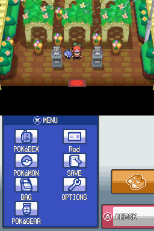
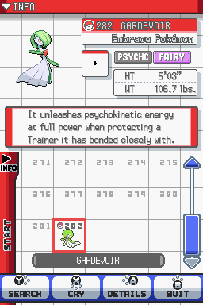

# Pokémon Edición Heart Red - Traducción al Español
Modificación de la ROM de Pokémon HeartGold Version que tiene como objetivo recrear el clásico videojuego Pokémon Rojo con las capacidades de la Nintendo DS.

Esta es una traducción completa al español, adaptando tanto los diálogos como la interfaz para una experiencia accesible.

## Características
- Inclusión del tipo hada.
- 493 Pokémon disponibles (hasta la 4° generación).
- Sistema de Pokémon acompañante (te siguen).
- Gráficos renovados con el estilo de Nintendo DS.
- Soporte para pantalla táctil.
- Ciclo diurno y nocturno.
- Miniiconos de Pokémon de Rubí Omega y Zafiro Alfa.

## Traducción
Los textos de los diálogos provienen de Pokémon Rojo Fuego, mientras que la interfaz se ha adaptado de Pokémon Oro HeartGold.

## Capturas

	
	&nbsp;
	

## Instalación
| Información de la ROM (No-Intro) |                                  |
|------------------------------|--------------------------------------|
| **Archivo**                  | Pokemon - HeartGold Version (USA).nds|
| **MD4**                      | 31294c88ab5cb87360993591a1e9f74d     |
| **MD5**                      | 258cea3a62ac0d6eb04b5a0fd764d788     |
| **SHA-1**                    | 4fcded0e2713dc03929845de631d0932ea2b5a37 |
| **CRC32**                    | c180a0e9                             |

1. Consigue la ROM base (verifica que coincidan los hashes).
2. Descarga el parche de Heart Red.
3. Aplica el parche a la ROM base usando una de las siguientes herramientas:
	- **Windows:** [Delta Patcher](https://www.gamebrew.org/wiki/Delta_Patcher) o [xdelta UI](https://www.gamebrew.org/wiki/Xdelta_UI).
	- **Mac:** [MultiPatch](https://www.gamebrew.org/wiki/MultiPatch).
	- **Linux:** [xdelta](https://www.gamebrew.org/wiki/Xdelta) o [Delta Patcher](https://github.com/marco-calautti/DeltaPatcher) con [Wine](https://www.winehq.org/).
4. Carga la ROM parcheada en tu emulador o flashcart.

## Comunidad
[¡Discord de Uzno Labs!](https://discord.gg/VW79XukCbj) - Servidor oficial, mantenete al día con este u otros de mis proyectos.

## Créditos
- **Chaos Rush** - Selección inicial y la primera batalla contra el rival.
- **brtatu** - Sprites para el protagonista.
- **Tebited15** - Sprite exterior de Hoja.
- **INNERMOBIUS** - Sprite trasero de Hoja.
- **Romruto** - Ícono de la ROM.
- **BT** - Logotipo.
- **Hiro_TDK** - Gráficos de introducción.
